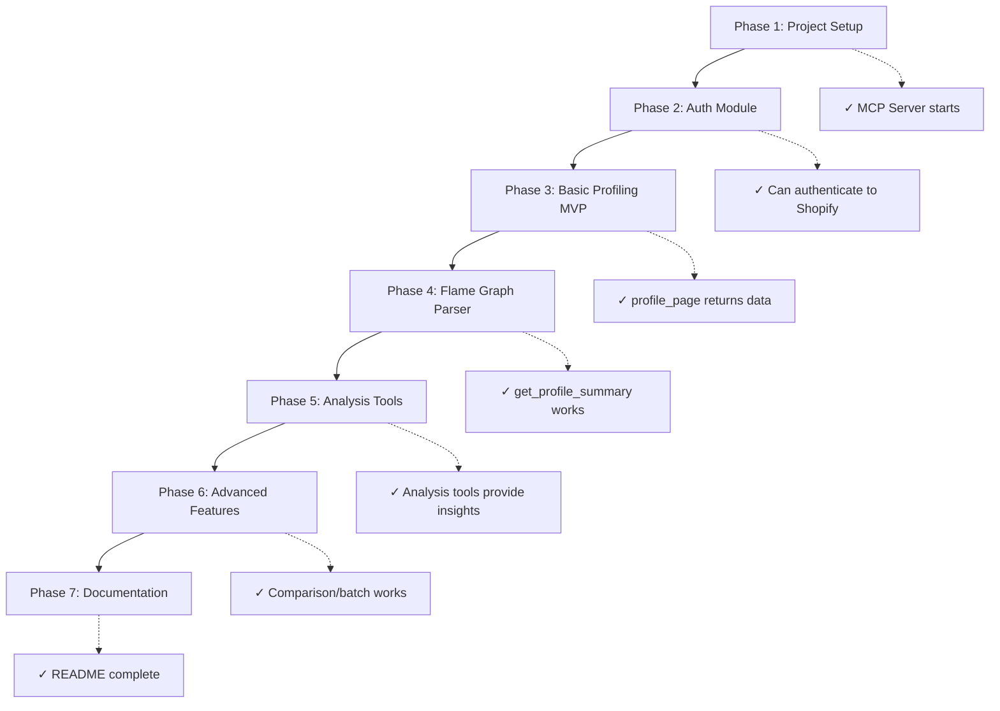

# Shopify Theme Inspector MCP - Implementation Plan

## Overview

This plan outlines the development of an MCP (Model Context Protocol) server that provides AI agents with the ability to profile and debug Liquid templates on Shopify stores. The server will expose tools that replicate and extend the functionality of the Shopify Theme Inspector Chrome extension.

### What is the Shopify Theme Inspector?

The Shopify Theme Inspector is a Chrome DevTools plugin that:

- Visualizes Liquid render profiling data as **flame graphs**
- Identifies slow-rendering Liquid code (templates, sections, snippets)
- Shows timing data for each Liquid node with file/line references
- Requires Shopify authentication (OAuth) with theme access permissions

### Why an MCP Server?

An MCP server allows AI coding agents to:

- Automatically profile store pages and identify performance issues
- Analyze Liquid code bottlenecks without manual Chrome DevTools interaction
- Provide actionable recommendations for Liquid optimization
- Compare performance across pages or before/after changes

---

## Authentication Approach (Confirmed)

> [!NOTE]
> Using **browser-based OAuth** similar to chrome-devtools MCP:
>
> - AI calls a `login` tool that opens system browser automatically
> - User logs into Shopify manually (like clicking a "Login" button)
> - MCP captures session cookies after successful login
> - Session is stored securely for future profiling requests

> [!WARNING]
> **Profiling Endpoint Access**: The profiling data is fetched via internal Shopify endpoints (not public API). This approach mimics what the Chrome extension does but may be subject to rate limiting or access restrictions. This MCP will only work for stores where you have theme access permissions.

---

## Technology Stack

| Component          | Technology                  | Rationale                          |
| ------------------ | --------------------------- | ---------------------------------- |
| Language           | **TypeScript**              | Type safety, good MCP SDK support  |
| MCP SDK            | `@modelcontextprotocol/sdk` | Official TypeScript MCP SDK        |
| HTTP Client        | `node-fetch` or `axios`     | For Shopify API/profiling requests |
| Browser Automation | `puppeteer`                 | For OAuth flow and page profiling  |
| Data Processing    | Built-in                    | JSON parsing, tree traversal       |

---

## Proposed Changes

### Phase 1: Project Setup & Basic MCP Server

#### [NEW] [package.json](file:///c:/Users/Administrator/Desktop/Shopify-Theme-Inspector-MCP/package.json)

Initialize Node.js project with TypeScript and MCP dependencies:

- `@modelcontextprotocol/sdk` - MCP server SDK
- `typescript`, `tsx` - TypeScript compilation
- `puppeteer` - Browser automation for profiling

#### [NEW] [tsconfig.json](file:///c:/Users/Administrator/Desktop/Shopify-Theme-Inspector-MCP/tsconfig.json)

TypeScript configuration with strict mode, ES2022 target.

#### [NEW] [src/index.ts](file:///c:/Users/Administrator/Desktop/Shopify-Theme-Inspector-MCP/src/index.ts)

Main MCP server entry point with:

- Server initialization
- Tool registration
- STDIO transport setup

#### [NEW] [src/tools/health.ts](file:///c:/Users/Administrator/Desktop/Shopify-Theme-Inspector-MCP/src/tools/health.ts)

Basic health check tool to verify MCP connection.

**Verification**: Run `npm run build` and test with MCP Inspector client.

---

### Phase 2: Shopify Authentication Module

#### [NEW] [src/auth/shopify-oauth.ts](file:///c:/Users/Administrator/Desktop/Shopify-Theme-Inspector-MCP/src/auth/shopify-oauth.ts)

Handles Shopify OAuth authentication:

- Opens browser for login if needed
- Stores session tokens securely
- Validates authentication status

#### [NEW] [src/auth/session-manager.ts](file:///c:/Users/Administrator/Desktop/Shopify-Theme-Inspector-MCP/src/auth/session-manager.ts)

Manages authenticated sessions:

- Token persistence (encrypted file storage)
- Session refresh
- Multi-store support

#### [NEW] [src/resources/store-config.ts](file:///c:/Users/Administrator/Desktop/Shopify-Theme-Inspector-MCP/src/resources/store-config.ts)

MCP resource for store configuration:

- Connected stores list
- Authentication status
- Store metadata

**Verification**: Test login flow with a test Shopify store.

---

### Phase 3: Profiler Core - Basic Profiling (MVP)

This is the **Minimum Viable Product** - a working profiler that returns raw data.

#### [NEW] [src/profiler/page-profiler.ts](file:///c:/Users/Administrator/Desktop/Shopify-Theme-Inspector-MCP/src/profiler/page-profiler.ts)

Core profiling logic:

- Fetches page with profiling enabled (`?_shopify_profiler=1`)
- Extracts profiling data from response
- Returns raw flame graph JSON

#### [NEW] [src/tools/profile-page.ts](file:///c:/Users/Administrator/Desktop/Shopify-Theme-Inspector-MCP/src/tools/profile-page.ts)

```typescript
// Tool: profile_page
// Input: { storeUrl: string, pagePath: string }
// Output: { success: boolean, totalTime: number, nodeCount: number, rawData: object }
```

**MVP Test**: Profile a store's homepage and verify flame graph data is returned.

---

### Phase 4: Flame Graph Data Processing

#### [NEW] [src/profiler/flamegraph-parser.ts](file:///c:/Users/Administrator/Desktop/Shopify-Theme-Inspector-MCP/src/profiler/flamegraph-parser.ts)

Parses and transforms flame graph data:

- Node interface with timing, file, line info
- Hierarchical tree traversal
- Aggregation by file/template

#### [NEW] [src/tools/get-profile-summary.ts](file:///c:/Users/Administrator/Desktop/Shopify-Theme-Inspector-MCP/src/tools/get-profile-summary.ts)

```typescript
// Tool: get_profile_summary
// Input: { storeUrl: string, pagePath: string }
// Output: {
//   totalRenderTime: number,
//   topSlowNodes: Array<{ name: string, time: number, file: string, line: number }>,
//   nodesByTemplate: Record<string, { count: number, totalTime: number }>
// }
```

**Verification**: Compare summary output with Chrome extension flame graph.

---

### Phase 5: Performance Analysis Tools

#### [NEW] [src/tools/find-slow-templates.ts](file:///c:/Users/Administrator/Desktop/Shopify-Theme-Inspector-MCP/src/tools/find-slow-templates.ts)

```typescript
// Tool: find_slow_templates
// Input: { storeUrl: string, pagePath: string, threshold?: number }
// Output: Array<{ template: string, totalTime: number, percentage: number, recommendations: string[] }>
```

#### [NEW] [src/tools/analyze-liquid-file.ts](file:///c:/Users/Administrator/Desktop/Shopify-Theme-Inspector-MCP/src/tools/analyze-liquid-file.ts)

```typescript
// Tool: analyze_liquid_file
// Input: { storeUrl: string, pagePath: string, fileName: string }
// Output: {
//   file: string,
//   renders: number,
//   totalTime: number,
//   hotspots: Array<{ line: number, time: number, tag: string }>
// }
```

#### [NEW] [src/tools/get-bottlenecks.ts](file:///c:/Users/Administrator/Desktop/Shopify-Theme-Inspector-MCP/src/tools/get-bottlenecks.ts)

```typescript
// Tool: get_bottlenecks
// Input: { storeUrl: string, pagePath: string }
// Output: {
//   issues: Array<{
//     severity: 'high' | 'medium' | 'low',
//     type: 'nested_loop' | 'too_many_renders' | 'slow_filter' | 'complex_conditional',
//     description: string,
//     file: string,
//     line: number,
//     suggestedFix: string
//   }>
// }
```

---

### Phase 6: Advanced Features

#### [NEW] [src/tools/compare-pages.ts](file:///c:/Users/Administrator/Desktop/Shopify-Theme-Inspector-MCP/src/tools/compare-pages.ts)

Compare performance between two pages or before/after changes.

#### [NEW] [src/tools/batch-profile.ts](file:///c:/Users/Administrator/Desktop/Shopify-Theme-Inspector-MCP/src/tools/batch-profile.ts)

Profile multiple pages in one request.

#### [NEW] [src/cache/profile-cache.ts](file:///c:/Users/Administrator/Desktop/Shopify-Theme-Inspector-MCP/src/cache/profile-cache.ts)

Cache profiling results to avoid repeated fetches.

---

## Development Phases (Step-by-Step)

Below is the recommended order with **test/verify points** after each phase:



---

## Verification Plan

### Automated Tests

Phase 1-2 will include unit tests:

```bash
# Run all tests
npm test

# Run with coverage
npm run test:coverage
```

### Manual Testing (Each Phase)

| Phase | Test Command                           | Expected Result                            |
| ----- | -------------------------------------- | ------------------------------------------ |
| 1     | `npx mcp-inspector node dist/index.js` | Server connects, health tool responds      |
| 2     | Call `authenticate` tool               | Browser opens, login succeeds              |
| 3     | Call `profile_page` with store URL     | Returns JSON with timing data              |
| 4     | Call `get_profile_summary`             | Returns parsed summary with top slow nodes |
| 5     | Call `find_slow_templates`             | Returns templates sorted by time           |

### Integration Test with AI Agent

After Phase 3, test with Claude/Gemini:

1. Ask agent to "Profile the homepage of my store at {url}"
2. Verify the agent receives and interprets profiling data correctly

---

## File Structure

```
Shopify-Theme-Inspector-MCP/
├── package.json
├── tsconfig.json
├── README.md
├── src/
│   ├── index.ts                 # MCP server entry point
│   ├── auth/
│   │   ├── shopify-oauth.ts     # OAuth flow
│   │   └── session-manager.ts   # Token storage
│   ├── profiler/
│   │   ├── page-profiler.ts     # Core profiling logic
│   │   └── flamegraph-parser.ts # Data transformation
│   ├── tools/
│   │   ├── health.ts
│   │   ├── profile-page.ts      # MVP tool
│   │   ├── get-profile-summary.ts
│   │   ├── find-slow-templates.ts
│   │   ├── analyze-liquid-file.ts
│   │   ├── get-bottlenecks.ts
│   │   ├── compare-pages.ts
│   │   └── batch-profile.ts
│   ├── resources/
│   │   └── store-config.ts
│   └── cache/
│       └── profile-cache.ts
├── tests/
│   └── ...
└── .env.example
```
